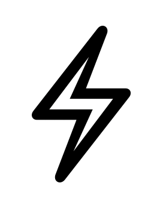
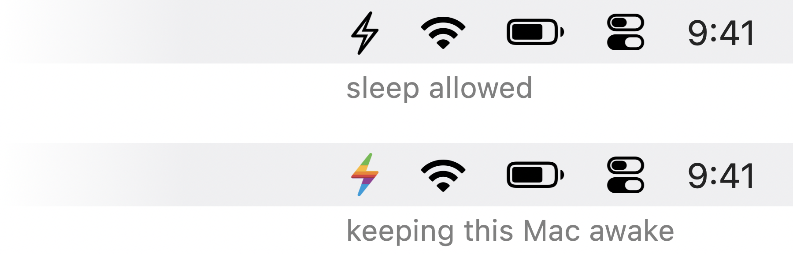
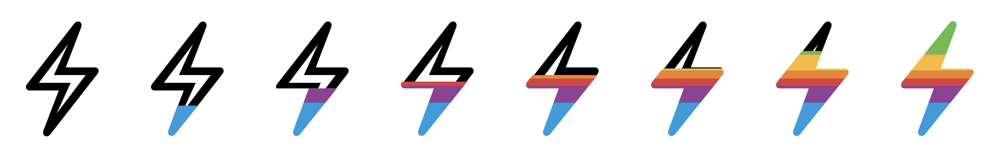

<div align="center">

# ⚡ Dynamo

**A menubar switch that keeps your Mac awake.**

One click. One lightning bolt. No preferences window.

[](https://www.apple.com/macos/)
[](https://developer.apple.com/documentation/appkit)
[](#build-it-yourself)
[](main.swift)

<br>

<picture>
  <source media="(prefers-color-scheme: dark)" srcset="docs/charge-dark.gif">
  
</picture>

</div>

---

## The whole app

<div align="center">
<picture>
  <source media="(prefers-color-scheme: dark)" srcset="docs/menubar-dark.png">
  
</picture>
</div>

| | |
|---|---|
| **Left-click** the bolt | Toggle awake on / off |
| **Right-click** the bolt | Show current state + **Quit** |
| **Hollow** bolt | Idle — your Mac sleeps normally |
| **Rainbow** bolt | Live — display and system sleep are blocked |

The bolt doesn't just swap glyphs — it **charges up**, filling from the bottom over about a third of a
second in the six colours of the old Apple logo, and drains back down when you switch it off. Click
again mid-animation and it reverses from wherever it got to.

<div align="center">
<picture>
  <source media="(prefers-color-scheme: dark)" srcset="docs/stages-dark.png">
  
</picture>
<br>
<sub><b>idle</b> ·············· charging ·············· <b>fully awake</b></sub>
</div>

That's the entire interface. There is no window, no Dock icon, no menu bar, and no settings.

## Why you might want it

- Long build, test run, or file copy that must not get interrupted by a sleeping machine.
- Screen-sharing or presenting and you'd rather the display not dim mid-sentence.
- You SSH into your desktop and need it to stay reachable.
- You just don't want to keep nudging the trackpad.

It's a friendly front-end for the `caffeinate` tool that already ships with macOS. Nothing is
installed system-wide, no background daemon is registered, and nothing runs unless you click it.

---

## Install it (for coworkers)

**Time: about 30 seconds.** You need the Xcode command line tools. Most people at Mozilla already
have them; if you're not sure, the first command below will tell you.

### Step 0 — one-time prerequisite

```bash
xcode-select -p
```

If that prints a path, you're set. If it errors, run this and accept the dialog:

```bash
xcode-select --install
```

### Step 1 — build and install

Copy and paste this whole block into Terminal:

```bash
git clone https://github.com/rcurranmoz/dynamo.git /tmp/dynamo && \
cd /tmp/dynamo && \
./build.sh && \
cp -R Dynamo.app /Applications/ && \
open /Applications/Dynamo.app
```

A lightning bolt appears in your menubar. Click it. Done.

> **Why build instead of downloading a `.app`?** Because building locally means macOS never puts the
> app in quarantine, so there's no "unidentified developer" warning, no Gatekeeper prompt, and no
> right-click → Open dance. It's genuinely the easier path here, and it's a single Swift file you can
> read end to end first if you want to.

### Step 2 — start it automatically at login (optional)

1. Open **System Settings**
2. Go to **General → Login Items & Extensions**
3. Under **Open at Login**, click **+**
4. Choose **/Applications/Dynamo.app**

### Uninstall

Quit it from the right-click menu, then:

```bash
rm -rf /Applications/Dynamo.app
```

Remove it from Login Items too if you added it there. Nothing else is left behind — no preferences,
no daemons, no support folders.

---

## Troubleshooting

| Symptom | Fix |
|---|---|
| No bolt in the menubar | Your menubar is probably full. Hold **⌘** and drag other icons to make room, or hide some via System Settings. |
| `xcode-select: error: ...` | Run `xcode-select --install` and accept the dialog, then retry Step 1. |
| `git: command not found` | Same fix — the command line tools include git. |
| Mac still sleeps on battery | Expected. The `-s` flag only blocks system sleep on AC power. Display sleep is still blocked either way. |
| Not sure it's actually on | Run the verification command below. |
| It stopped working after a macOS update | Rebuild: rerun the Step 1 block. |

### Verify it's really working

With the bolt **filled**, run:

```bash
pmset -g assertions | grep -E 'PreventUserIdleDisplaySleep|PreventSystemSleep|PreventUserIdleSystemSleep'
```

All three should read `1`. Toggle the bolt off and they drop back to `0`.

---

## How it works

When you switch it on, Dynamo spawns exactly one child process:

```
/usr/bin/caffeinate -dimsu -w <dynamo's own pid>
```

| Flag | Prevents |
|---|---|
| `-d` | Display sleep |
| `-i` | System idle sleep |
| `-m` | Disk idle sleep |
| `-s` | System sleep (while on AC power) |
| `-u` | Declares user activity, so the display stays on |
| `-w <pid>` | Makes `caffeinate` wait on Dynamo and exit when it does |

That last flag is the part worth knowing about. Dynamo already kills the child on toggle-off and on
clean quit, but `-w` covers the ugly cases: a force quit, a crash, a `kill -9`. Without it you can
orphan a `caffeinate` process that silently holds a power assertion forever, and the only symptom is
a Mac that mysteriously refuses to sleep, days later, with no icon anywhere to explain why. This is
the single most common bug in homegrown caffeinate wrappers.

---

## Build it yourself

```bash
./build.sh      # compiles main.swift, assembles the bundle, ad-hoc signs it
open Dynamo.app
```

`build.sh` deletes and recreates `Dynamo.app` in place on every run, so the bundle is a build
artifact and is gitignored. The build targets `arm64-apple-macos13.0` — change the `-target` line in
`build.sh` for Intel or an older minimum.

The preview assets in `docs/` are generated, not hand-drawn:

```bash
swiftc -O tools/make-preview.swift -o /tmp/make-preview && /tmp/make-preview
```

That tool mirrors the icon compositing from `main.swift`, so the previews are crisp vector renders
rather than upscaled menubar rasters. It emits the charge-up GIF and the eight-stage filmstrip at
120pt, and the menubar mockup at the real 15pt size in a 24pt bar. It's a documentation tool sitting
outside the app, so if you change how the icon is drawn, change it in both places.

### Implementation notes

- `LSUIElement` plus `NSApplication.setActivationPolicy(.accessory)` keeps Dynamo out of the Dock and
  out of the menu bar. The status item is the entire user interface.
- The right-click menu is attached and immediately detached around the click. If the menu stayed
  attached to the status item, AppKit would pop it on left-click too, and the one-click toggle would
  be gone.
- Ad-hoc signing (`codesign --sign -`) gives the app a stable identity across rebuilds, so macOS
  doesn't re-evaluate it every time you rebuild.
- The icons are the SF Symbols `bolt` and `bolt.fill`. At rest the plain template symbol is handed
  straight to the menubar; the coloured frames are composited, and handle light/dark themselves (see
  below).

### The fill animation

SF Symbols has no variable-value `bolt`, so the charge-up is composited by hand: the hollow `bolt`
outline is drawn whole, then `bolt.fill` is drawn over it clipped to a rectangle that rises from the
bottom. The two glyphs differ by a point in height, so each is centered at its natural size in a
shared canvas rather than one being stretched to fit the other.

The rainbow is painted with `.sourceAtop` compositing, which confines colour to the glyph's own alpha
— the bolt shape does the masking, so no separate mask image is needed. The outline is clipped to the
*unfilled* region rather than drawn underneath: `bolt` is a point taller than `bolt.fill`, so letting
them overlap leaves a pale rim peeking out around the colour. Invisible at 15×20, obvious the moment
you render a preview at 120pt. Six flat bands beat a smooth
gradient here: at 20 pixels tall a gradient collapses into an orange smear and loses green and blue
entirely.

### Measuring the glyph's ink

A rectangle rising at constant speed looks wrong. The bolt's ink is concentrated in its upper middle
— the bottom third of its height holds barely a tenth of its pixels — so a linear clip creeps up the
thin tail for half the animation and then snaps solid. Equal-height colour bands have the same
problem in reverse: green ends up a sliver on the tip while red and orange dominate.

Both fall out of one measurement. At launch Dynamo rasterizes `bolt.fill` at 8× and sums alpha per row
to build a cumulative ink curve, then inverts it. That inverse gets used twice:

| Derived from the curve | Effect |
|---|---|
| 25 animation steps | Equal time means equal **ink**, so the fill reads smooth |
| 7 band boundaries | Equal ink per colour, so all six are equally visible |

The curve is measured at runtime rather than baked in as a lookup table, so it stays correct if Apple
ever redraws the symbol. If the rasterization fails for any reason it falls back to plain linear
spacing.

### Light and dark

Coloured images can't be template images, so the menubar won't tint them — which means the hollow part
of a partially-filled bolt has to be tinted explicitly. Dynamo resolves `NSColor.labelColor` against
`NSApp.effectiveAppearance` (black at 85% under Aqua, white at 85% under Dark Aqua) and bakes that into
the frame. Because it's baked, the cache is dropped on `AppleInterfaceThemeChangedNotification` so a
theme switch re-renders.

The idle state is the exception: at rest Dynamo hands the menubar the plain `bolt` template symbol, so
the icon you see 99% of the time gets native tinting and click-highlighting for free.

### Caching

Frames are quantized to 24 steps and cached, so a toggle rasterizes at most 24 images once and then
replays them for free. Easing is smoothstep, and each animation starts from the current level rather
than from 0 or 1, which is what makes a mid-flight click reverse smoothly instead of snapping.

---

## Family

Part of a personal RelOps tooling set — a fleet dashboard, a couple of iOS monitoring apps, a fleet
CLI. Dynamo is by far the least ambitious of them, which is the point.

<div align="center">
<sub>⚡ Built because the coffee cup icon was taken.</sub>
</div>
